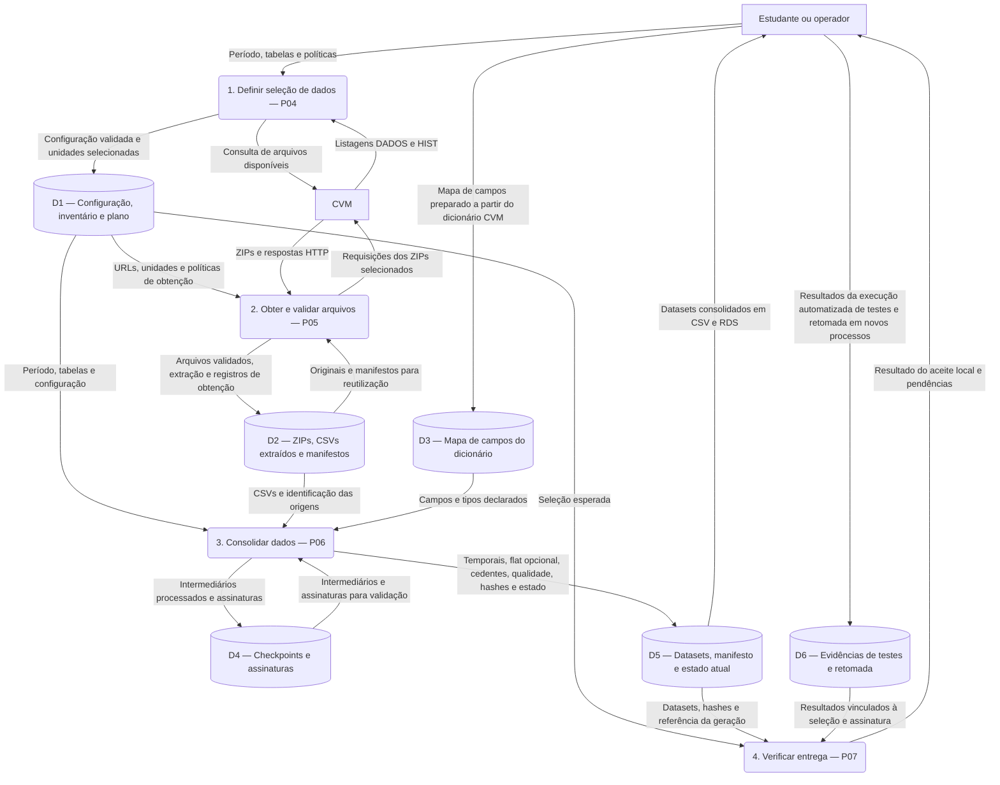

# Arquitetura — diagrama de fluxo de dados

Este documento descreve como os informes mensais de FIDCs da CVM se tornam datasets consolidados no tempo e uma tabela final única (flat). O diagrama de fluxo de dados (DFD) representa as entradas, as transformações, os depósitos locais e os resultados do pipeline. Sua referência é o piloto de julho/agosto de 2026, validado localmente.

A arquitetura resulta dos sete prompts P01–P07. P04, P05 e P06 definem as transformações dos dados, enquanto P07 verifica a entrega. P01 organiza a execução dessas etapas, P02 fornece funções comuns e P03 orienta a preparação do ambiente. Essa distinção explica por que os sete prompts não aparecem como sete processos de transformação no DFD.

## Diagrama de fluxo de dados

O DFD abaixo apresenta o pipeline em um único nível de detalhe. Retângulos representam entidades externas, formas arredondadas representam processos e cilindros representam depósitos de dados. Cada seta nomeia a informação transferida. A numeração dos processos identifica sua responsabilidade no diagrama; os códigos P04–P07 indicam os prompts correspondentes.

O estudante informa o período, as tabelas e as políticas de processamento. P04 confronta essa seleção com as listagens da CVM e grava a configuração, o inventário e o plano em D1. P05 lê esse plano, obtém os ZIPs e valida seu conteúdo antes de registrar os originais, a extração e os manifestos em D2. Quando há arquivos anteriores válidos, os mesmos registros sustentam sua reutilização.

P06 recebe os CSVs de D2, a configuração de D1 e o mapa de campos de D3. Esse mapa é um artefato preparado a partir do dicionário oficial no trabalho de P04; a execução de P06 lê o arquivo local, sem baixar o dicionário automaticamente. A leitura conserva identificadores textuais, representações numéricas originais e referências ao ZIP, ao arquivo e à linha de origem. Os checkpoints de D4 permitem retomar intermediários cuja assinatura e integridade sejam válidas.

A consolidação reúne as competências em um dataset por tabela. Depois, abre as múltiplas linhas de cada CNPJ/competência em posições próprias de cada leiaute e integra as chaves em um flat por junção externa completa. As posições de tabelas diferentes são independentes. Assim, o flat preserva detalhes e chaves sem produzir combinações cartesianas ou somar valores por uma interpretação não confirmada. A base de cedentes é produzida como dataset complementar.

D5 contém a geração de saída, seu manifesto de hashes, o relatório de qualidade e a referência ao estado atual. No modo completo, a entrega é formada por **18 datasets temporais, um flat e uma base de cedentes**, cada um em CSV e RDS: **40 arquivos de dados**. O modo temporal, configurado com `gerar_flat=FALSE`, entrega os temporais e cedentes em 38 arquivos de dados e tem aceite próprio. O relatório de qualidade acrescenta CSV/RDS aos dois modos. Parquet é uma exportação opcional que preserva os formatos obrigatórios.

Os temporais abrangem I, II, III, IV, V, VI, VII, VIII, IX, X, X_1, X_1_1, X_2, X_3, X_4, X_5, X_6 e X_7. A referência atual identifica a geração validada; `execucao.rds` registra a tentativa mais recente e impede que uma falha seja apresentada como sucesso anterior. As partes de cada tabela são reunidas uma vez antes da escrita, reduzindo concatenações repetidas.

P07 consulta essa entrega e a seleção esperada, confere arquivos, hashes, unicidade e cobertura da chave do flat quando habilitado e avalia as evidências em D6. O produtor de evidências executa a suíte e a interrupção/retomada/repetição em novos processos R, com entradas locais. Cada evidência vincula configuração completa, assinatura da geração, hash dos artefatos e hash do conteúdo dos scripts, testes e lockfile. Booleanos manuais não aprovam o aceite operacional. O resultado informa ao estudante o aceite do modo e as pendências; o [relatório de aceite](P07_ACEITE_ENTREGA.md) distingue as evidências locais da CI e do piloto real.

## Relação entre o DFD e os prompts

Os prompts são instruções para construir e verificar o software com IA e revisão humana. Os processos do DFD representam o comportamento do software produzido. A correspondência abaixo conecta essas duas perspectivas e identifica o papel dos prompts de apoio.

| Prompt | Relação com o DFD |
|---|---|
| **P01 — Coordenação** | Encaminha a etapa solicitada e registra sua continuidade. Organiza a execução dos processos 1–4, mas não transforma os informes. Cada etapa é invocada explicitamente; as setas do DFD representam dados, sem determinar execução automática. |
| **P02 — Biblioteca comum** | Sustenta os processos com caminhos, hashes, escrita validada e recuperação conservadora de rollback. Mantém dependências fixadas por renv e o runner de testes usado localmente e na CI. Os resultados locais apoiam D6; a CI permanece evidência separada. |
| **P03 — Preparação do ambiente** | Define o roteiro documental para preparar os recursos necessários à execução. Seu produto é o roteiro; por isso, fica fora do fluxo operacional dos dados. Seu aceite não exige instalar ferramentas, criar VM ou executar o roteiro. |
| **P04 — Configuração** | Corresponde ao processo 1 e a D1. Define período, tabelas, inventário e plano de obtenção. O trabalho de leitura do dicionário também prepara o mapa local em D3, usado por P06. |
| **P05 — Obtenção dos dados** | Corresponde ao processo 2 e a D2. Especifica download, validação, preservação dos originais, extração e manifestos. |
| **P06 — Consolidação** | Corresponde ao processo 3 e aos depósitos D4/D5. Define leitura, qualidade, retomada, temporais, flat opcional e cedentes. As medições de tempo, tamanho e heap R ficam em logs, com método documentado. |
| **P07 — Aceite e entrega** | Corresponde ao processo 4, que examina D5 com apoio de D1/D6. Define os critérios e as evidências necessários para aceitar o conjunto de resultados. |

Essa relação permite rastrear uma alteração do resultado até o prompt responsável. Uma mudança na seleção pertence a P04 e modifica D1; uma mudança na leitura ou na consolidação pertence a P06 e exige revisar o mapa ou a versão da transformação, os checkpoints e as saídas afetadas. P07 deve então verificar a nova geração com evidências correspondentes. P01 e P02 mantêm a coordenação e os serviços comuns necessários a essas operações.

## Persistência e limites da representação

Os depósitos do DFD são arquivos locais. D1 corresponde a `dados/configuracao.rds`; D2 reúne `dados/originais`, `dados/extraidos`, manifestos e o registro de downloads; D3 corresponde a `P04_CAMPOS_DECLARADOS_DICIONARIO.csv`; D4 fica em `checkpoints`; D5 reúne `saidas/geracoes` e `saidas/atual.rds`; D6 inclui os resultados de testes e o registro `logs/evidencias_aceite.rds`. O [README](README.md) apresenta os comandos para produzir e consultar esses artefatos.

O fluxo executa localmente em R. RStudio e Codex apoiam o desenvolvimento; Git e GitHub publicam código e documentação em um fechamento separado. A função de aceite não consulta o GitHub: a sincronização remota exige conferência própria, descrita em [PUBLICACAO](PUBLICACAO.md). Dados, saídas, checkpoints e logs permanecem locais e fora do Git.

Rollback válido é restaurado conservadoramente e o destino interrompido fica preservado. Manifestos RDS corrompidos são segregados para diagnóstico; não viram prova de sucesso. No download, o ZIP anterior é mantido até a confirmação do manifesto final. Nas saídas, o marcador da tentativa e a referência atual são conferidos pelo aceite. Uma falha de gravação impede a aprovação, mesmo quando a geração anterior ainda existe. Essa recuperação não oferece transação conjunta entre arquivos nem resolve automaticamente backup inválido ou bloqueio do OneDrive.

O diagrama descreve o protótipo e seus modos, sem homologar todos os leiautes históricos, unidades monetárias ou escalas percentuais. Dependências fixadas tornam a execução verificável, sem provar reprodução em máquina limpa. A conferência do DFD foi textual, contra os scripts; não foi executado um renderizador Mermaid nesta revisão. [DESEMPENHO](DESEMPENHO.md) documenta as medidas e seus limites.
